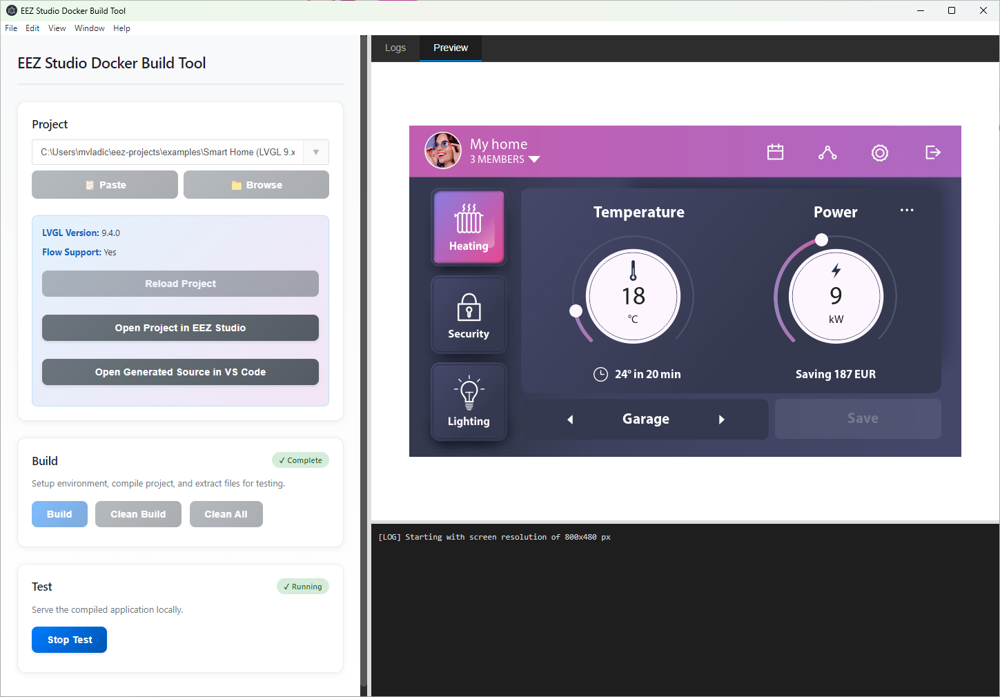

# EEZ Studio Docker Build Tool

<div align="center">
  
  <p>Electron application for building <a href="https://github.com/eez-open/studio">EEZ Studio</a> LVGL projects using Docker and Emscripten</p>
</div>



## About

This tool provides a user-friendly desktop interface for building LVGL-based projects created with [EEZ Studio](https://github.com/eez-open/studio). It uses the [lvgl-simulator-for-studio-docker-build](https://github.com/mvladic/lvgl-simulator-for-studio-docker-build) repository to compile your projects into WebAssembly applications that run in the browser.

**Key Components:**
- **EEZ Studio**: Visual development tool for creating LVGL user interfaces
- **Build Repository**: [lvgl-simulator-for-studio-docker-build](https://github.com/mvladic/lvgl-simulator-for-studio-docker-build) - LVGL simulator with Emscripten build scripts
- **Docker**: Isolated build environment with Emscripten toolchain
- **This Tool**: Desktop GUI that orchestrates the build process

## Features

- **Simplified Workflow**: One-click Build button that handles Setup → Build → Extract automatically
- **Project Management**: Browse .eez-project files with recent projects dropdown and clipboard paste
- **Docker Integration**: Automated volume management with persistent Emscripten environment
- **Test Server**: Built-in web server with live preview, console output, and cache-busting
- **Tabbed Interface**: Separate views for build logs and test preview/console
- **Clean Options**: Clean Build (removes build directory) or Clean All (fresh start from scratch)
- **Abort Support**: Cancel long-running build operations mid-process
- **Smart Logs**: Searchable, filterable logs with timestamps, word wrap, and autoscroll
- **Resizable Panels**: Customizable layout with draggable splitters
- **Persistent Settings**: Remembers last project, window state, panel sizes, and log preferences
- **VS Code Integration**: Open generated source files directly in VS Code
- **EEZ Studio Integration**: Quick-open projects in EEZ Studio

## Prerequisites

- **Docker Desktop**: Must be installed and running
  - Download: https://www.docker.com/products/docker-desktop
- **Supported Platforms**: Windows, macOS, Linux
- **LVGL Versions**: 8.4.0, 9.2.2, 9.3.0, 9.4.0

## Installation

```bash
npm install
```

## Running the Application

```bash
npm start
```

For development mode with DevTools:

```bash
npm run dev
```

## Building Distributables

Build for all platforms:
```bash
npm run build
```

Build for specific platform:
```bash
npm run build:win    # Windows (NSIS installer + portable)
npm run build:mac    # macOS (DMG + ZIP)
npm run build:linux  # Linux (AppImage + DEB)
```

Output will be in the `dist/` folder.

## Workflow

### Quick Start
1. **Select Project**: Choose your .eez-project file or paste path from clipboard
2. **Click "Build"**: Automatically runs Setup → Build → Extract in one operation
3. **Click "Start Test"**: Launch the web preview with live console
4. **View Results**: Switch between Logs and Preview tabs

### Build Process
The **Build** button performs three steps automatically:
1. **Setup**: Initializes Docker environment, clones/updates repository, copies your source files
2. **Build**: Compiles the project with Emscripten (LVGL + your UI code)
3. **Extract**: Copies the compiled WebAssembly files to the output directory

### Clean Options
- **Clean Build**: Removes only the `/project/build` directory (forces recompilation)
- **Clean All**: Removes entire `/project` directory (fresh clone from GitHub next build)

### Abort Operations
- Click **Abort** button during Build to cancel the operation
- The current Docker process is terminated immediately
- Useful for long builds or when you need to make changes

## Project Structure

```
src/
  main/
    main.js          # Electron main process with Docker/IPC handlers
    preload.js       # Secure IPC bridge
  renderer/
    index.html       # Main UI markup
    app.js           # UI logic and state management
    styles.css       # Modern gradient styling
docker-build/
  Dockerfile         # Emscripten 4.0.20 with FreeType support
  docker-compose.yml # Docker services with named volume
  output/            # Extracted build files (index.html, index.js, etc.)
assets/
  icon.png           # Application icon (Linux)
  icon.ico           # Application icon (Windows)
  icon.icns          # Application icon (macOS)
```

## Docker Volumes

The tool uses a single named volume for efficient builds:
- **lvgl-simulator**: Persistent Docker volume containing the cloned [lvgl-simulator-for-studio-docker-build](https://github.com/mvladic/lvgl-simulator-for-studio-docker-build) repository and Emscripten cache

The repository is cloned once on first setup, then updated via `git pull` on subsequent builds. Source files from your project's destination folder (configured in EEZ Studio settings) are copied to `/project/src/` before each build.

## UI Features

### Recent Projects
- Click the dropdown arrow (▼) next to the project path field
- Navigate with arrow keys, Enter to select
- Recently used projects appear at the top

### Clipboard Paste
- The **📋 Paste** button is only enabled when clipboard contains an `.eez-project` path
- Automatically detects valid project paths

### Reload Project
- Refresh project settings without restarting the app
- Useful after changing LVGL version or display settings in EEZ Studio

### Open in EEZ Studio / VS Code
- **Open Project in EEZ Studio**: Launch the .eez-project file
- **Open Generated Source in VS Code**: Open the destination folder (visible only if folder exists)

### Status Badges
- **Pending**: Gray - operation not started
- **In Progress**: Yellow with pulse animation - currently running
- **Complete**: Green - operation successful
- **Error/Aborted**: Red - operation failed or cancelled

## Keyboard Shortcuts

- **Arrow Keys**: Navigate recent projects dropdown
- **Enter**: Select highlighted project in dropdown
- **Escape**: Close dropdown
- **Tab**: Close dropdown and move to next field

## Troubleshooting

### Docker Not Found
- Install Docker Desktop from https://www.docker.com/products/docker-desktop
- Ensure Docker Desktop is running before launching the app
- Check that `docker --version` works in your terminal

### Build Failures
- Check Docker logs in the Logs tab for detailed error messages
- Verify destination folder (from EEZ Studio settings) exists and contains generated files
- Ensure LVGL version is supported (8.4.0, 9.2.2, 9.3.0, 9.4.0)
- Try **Clean All** followed by **Build** for a fresh start

### Test Server Issues
- The test server automatically finds available ports starting from 3000
- If preview doesn't load, check browser console in the Console tab
- Build must complete successfully before Test button is enabled
- Click **Stop Test** and **Start Test** again to refresh with cache-busting

### Volume Cleanup
If you need to reset the Docker volume:
```bash
docker volume ls
docker volume rm lvgl-simulator
```

Next build will clone the repository from scratch.

### Abort Not Working
- Abort terminates the current Docker process
- If operations still continue, restart the application
- Check that no orphaned Docker containers are running: `docker ps -a`

## Configuration

### Project Settings (in EEZ Studio)
- **LVGL Version**: Determines which LVGL library to use
- **Display Width/Height**: Canvas size for the simulator
- **Destination Folder**: Where EEZ Studio generates source files (default: `src/ui`)
- **Flow Support**: Enable/disable flow runtime

### Application Settings
Automatically saved:
- Window size and position
- Panel splitter positions
- Recent projects list (last 10)
- Log preferences (timestamps, autoscroll, word wrap)

## License

MIT License - see [LICENSE](LICENSE) file for details

## Development

### Project Architecture
- **Electron**: Desktop application framework
- **Docker/Emscripten**: Isolated build environment
- **Express**: Local test server
- **IPC Communication**: Secure renderer ↔ main process messaging

### Key Technologies
- Electron 29+
- Node.js with async/await
- Docker Compose with named volumes
- Emscripten 4.0.20
- FreeType 2.14.1 (for advanced text rendering)
